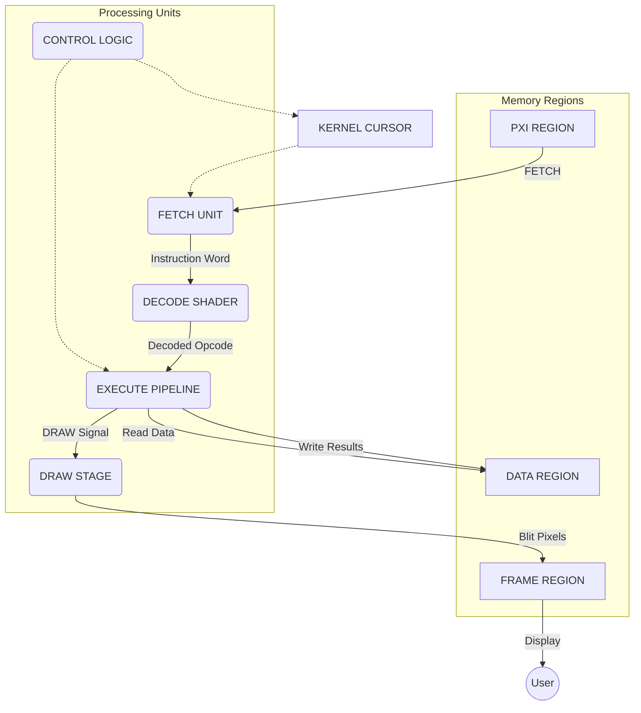

# Pixel Flow Diagram for pxOS

This document specifies the data flow for the pxOS kernel's core execution cycle, from fetching instructions to drawing the final frame.

## Execution Cycle Flowchart

The following diagram illustrates the FETCH -> DECODE -> DRAW cycle.

## Flow Description

1.  **FETCH:** The `FETCH UNIT` reads a PXI (Pixel Instruction) from the `PXI REGION` at the location specified by the `KERNEL CURSOR`.
2.  **DECODE:** The `DECODE SHADER` interprets the RGBA channels of the instruction pixel to determine the operation and its operands.
3.  **EXECUTE:** The `EXECUTE PIPELINE` runs the corresponding operation, reading from and writing to the `DATA REGION`.
4.  **CONTROL:** The `CONTROL LOGIC` updates the `KERNEL CURSOR` (e.g., incrementing it or handling a `JUMP` instruction) and manages the execution flow.
5.  **DRAW:** When a `DRAW` instruction is executed, the `DRAW STAGE` copies the final image from the `DATA REGION` to the `FRAME REGION`.
6.  **DISPLAY:** The `FRAME REGION` is presented to the user.
